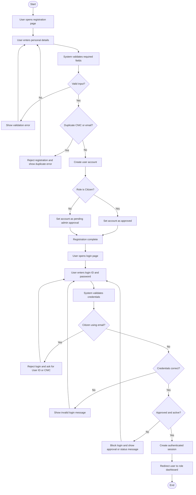
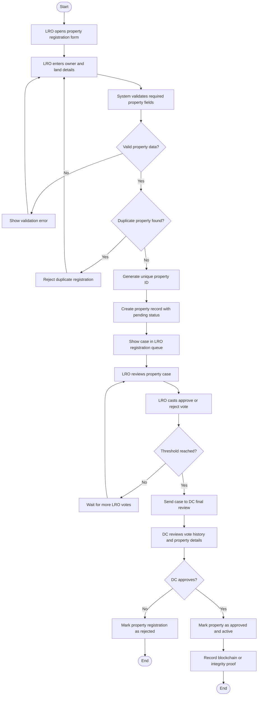
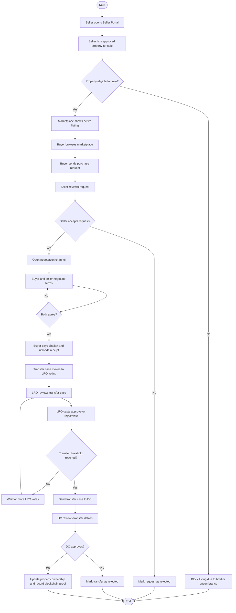
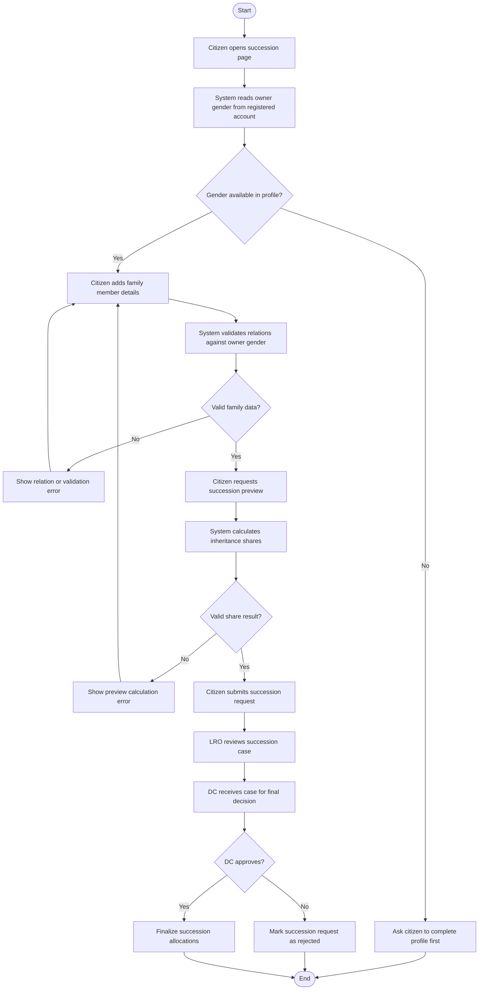
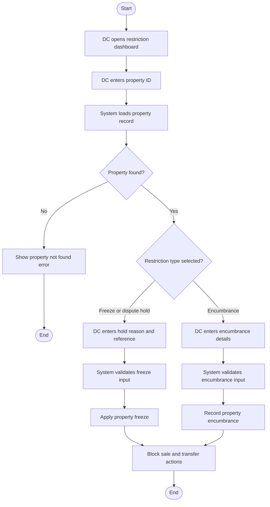
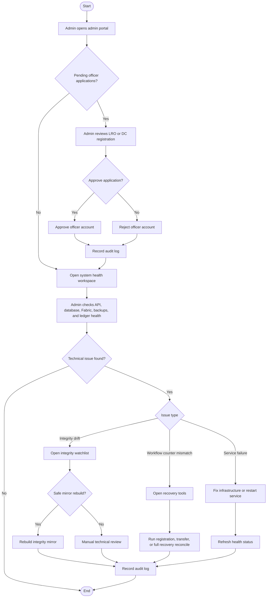

# Activity Diagrams

This file contains activity-diagram-ready flows for the current PLRA system.
You can:

- preview them as Mermaid diagrams in Markdown tools
- use them as the source for redraw in Draw.io
- copy the step logic directly into your report

## 1. User Registration And Login

## 2. Property Registration Management

## 3. Property Transfer Management

## 4. Succession Management

## 5. Property Restriction Management

## 6. Admin Approval And Recovery

## Draw.io Notes

- Use `start/end` as oval shapes.
- Use `process/activity` as rectangles.
- Use `decision` as diamonds.
- Use arrows for control flow.
- If you want cleaner report diagrams, put each actor in a swimlane:
  - User or Citizen
  - System
  - LRO
  - DC
  - Admin

## Best Diagrams For Report

If you only want the most important activity diagrams in your report, use:

1. User Registration And Login
2. Property Registration Management
3. Property Transfer Management
4. Succession Management
